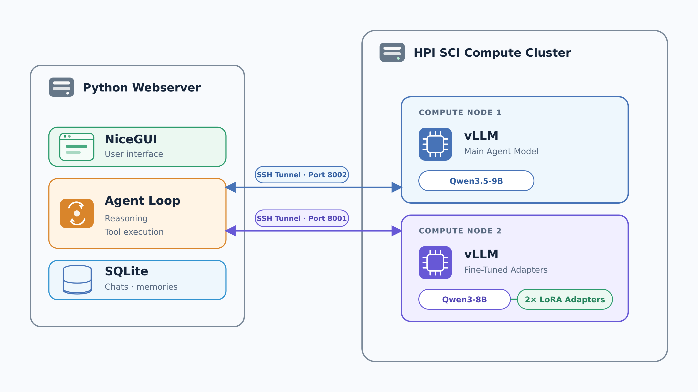
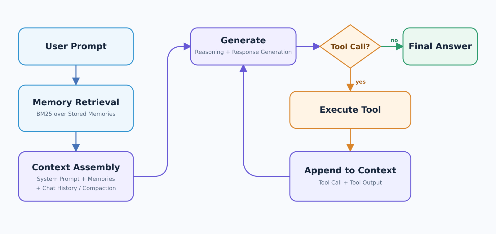

# Intelligent Agents Chat

## Features

Required
- [x] multiple models
- [x] start / stop / resume chats
- [x] Cross-Chat Project Memory
- [ ] Finetuning (1/2)
  - [x] Finetuning 1
  - [ ] Finetuning 2 

Elective

- [x] Sub-Agent
- [x] Websearch
- [x] Context Management
  - [x] Isolation
  - [x] Selection
  - [x] Compressing
- [x] RAG

## Architecture



The local Python server runs the NiceGUI interface, agent loop, tools, and SQLite storage
(`.data/chats.sqlite3`). The HPI SCI Compute Cluster runs model inference through vLLM in
Enroot containers, scheduled with Slurm. SSH tunnels expose those APIs on local ports.

This separation is deliberately modular: the agent talks to an OpenAI-compatible API and does
not need to know which compute node or model is behind it. There is no architectural limit of
two vLLM instances; more can be added as cluster resources allow. We provide two configurations:

| vLLM instance | Purpose | Local tunnel port | Slurm script |
| --- | --- | --- | --- |
| Qwen3.5 9B | Main model for agent skills, including tool use and reasoning | `8002` | [run-vllm-qwen35-9b.sbatch](cluster/run-vllm-qwen35-9b.sbatch) |
| Qwen3 8B + two LoRA adapters | Base model and our two fine-tunings | `8001` | [run-vllm-qwen3-8b.sbatch](cluster/run-vllm-qwen3-8b.sbatch) |

### Model profiles

Profiles in [models.py](src/intelligent_agents_chat/models.py) connect a model name to an API
endpoint and declare capabilities such as tool use. Switching profiles in the UI sends requests
to the corresponding port and vLLM instance. Adapters share their base model's endpoint and are
selected by model name. Adding another server means adding a profile and a tunnel, without
changing the agent loop. A local Ollama profile is also included for lightweight testing.

## Run with the HPI SCI Compute Cluster

There are **three steps**. The web application and tunnels run locally; only vLLM runs on the
cluster. This assumes `uv` is installed locally, SCI VPN/SSH access works, and the cluster
checkout, model files, adapters, and Enroot image are prepared in the project's storage.

### 1. Start the application locally

From the repository on **your own machine, not the cluster**:

```bash
uv sync
uv run intelligent-agents-chat
```

Open <http://localhost:8080>. Keep this process running; models become available once their
servers and tunnels are up.

### 2. Start a vLLM instance on the cluster

On the cluster, from the prepared checkout:

```bash
cd /sc/projects/sci-lippert/intelligent-agents/project_matthias_max/code/intelligent-agents-chat
sbatch cluster/run-vllm-qwen35-9b.sbatch
```

For Qwen3 8B and the LoRA adapters, use `sbatch cluster/run-vllm-qwen3-8b.sbatch` instead,
or submit both jobs. **Both instances do not have to run at once.** Qwen3.5 9B alone is enough
for the agent features; Qwen3 8B alone is enough for ordinary chats and testing fine-tunings.
Select a profile belonging to the running instance in the UI.

### 3. Open the SSH tunnel locally

After the vLLM job has started, open another terminal on **your own machine**:

```bash
bash cluster/tunnel.sh qwen35-9b YOUR_HPI_USERNAME
```

For the other instance, use `bash cluster/tunnel.sh qwen3-8b YOUR_HPI_USERNAME`.
The script reads the job's `.endpoint` file through the login node, automatically finds the
compute node, and forwards its API to local port `8002` or `8001`. Keep the terminal open.
If both instances are running, open one tunnel per instance in separate terminals.

## Agent loop



For each user message, we retrieve relevant project memories and assemble the model's context.
The model then generates an answer or requests a tool. The local application executes tool calls,
appends their results to the context, and asks the model to continue. This repeats until the model
answers without another tool call or the round limit is reached.

Tool calls run sequentially, including delegated tasks. Limits on rounds and calls keep a turn
bounded. The UI streams the answer and shows reasoning and tool activity separately; the stored
conversation can be reopened later. Context preparation lives in
[context.py](src/intelligent_agents_chat/context.py), while
[chat.py](src/intelligent_agents_chat/chat.py) implements the loop and tool registry.

## Feature overview

| Category | Feature | Idea and design decisions |
| --- | --- | --- |
| Required | Memory | [Recall relevant turns from other chats in the same project](docs/memory.md) |
| Required | Two LoRA fine-tunings | [Adapt one shared base model with separately selectable adapters](docs/fine-tuning.md) |
| Elective | Websearch | [Search for sources, then read and condense selected pages](docs/websearch.md) |
| Elective | Subagents | [Delegate focused tasks with isolated context](docs/subagents.md) |
| Elective | Intelligent context management | [Select, isolate, and compress information within the context window](docs/context-management.md) |
| Elective | RAG | [Search a project's uploaded documents, decided and queried by the agent itself](docs/rag.md) |
