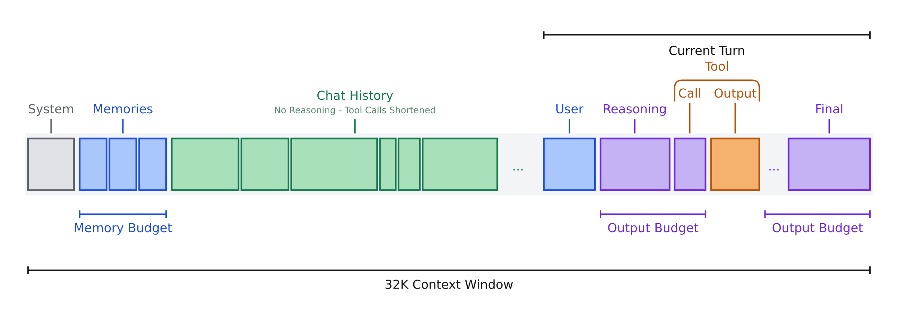
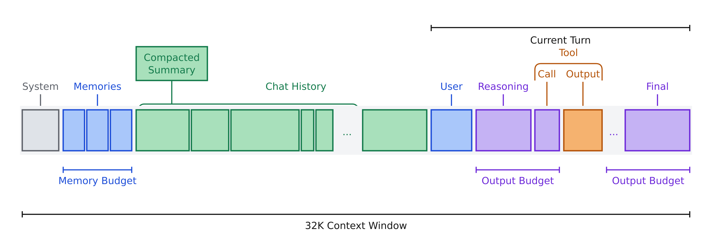

# Intelligent context management

[Back to the overview](../README.md#feature-overview)

The saved conversation and the model's context are different things. We keep the chat for
display and persistence, but assemble a bounded input for each new turn. Our design combines
**selection, isolation, and compression** to make room for useful information in the configured
32K context window.

## Selection and budgets

The context assembler first reserves space for output, then prioritizes the system prompt and
current user message. Retrieved [memories](memory.md) get a limited budget before the remaining
space is filled with recent history. Otherwise a long chat could crowd out the very information
we need to recall from another conversation. The default retrieval budget is 2,048 tokens;
the output reserve is 1,024 tokens normally and 8,192 with thinking enabled.

The assembled order is system prompt, retrieved reference blocks, selected history, and the
current user message. Memories include source markers and are explicitly framed as untrusted
reference data. They are placed in a separate `user`-role message, not promoted to system
instructions. We keep just one leading system message because the model chat templates impose
constraints on where that role can appear.

## Isolation and shorter traces

Reasoning is displayed and saved separately, but is not replayed as chat history. Once a turn
is over, its full tool results are replaced by short trace notes recording the calls and their
outcomes, alongside the user message and final answer. The current turn keeps its full tool
calls and results so the agent can continue working with what it just found.

Trace notes are marked as application notes, separate from assistant answers. This came from
an observed failure: when traces were part of assistant messages, the model started imitating
their notation in its own replies. [Subagents](subagents.md) provide another form of isolation:
their intermediate context never becomes part of the main chat.

## Compaction

If history no longer fits, a subagent summarizes older turns while leaving the three most
recent turns outside the summary. Later compactions extend that rolling summary with newly
aged-out turns, instead of repeatedly summarizing the entire conversation. The summary and
its message boundary are stored separately; the original messages remain in SQLite.

Budgeting uses a character-based token estimate, so it is approximate. Tool results can also
grow the context during a turn, and each model call gets its own output budget. If the server
reports an actual context overflow, the application attempts compaction and a retry. This
is not a guarantee that every input will fit: summaries can lose detail, and mandatory input
or the active turn can still be too large.

Code: [context.py](../src/intelligent_agents_chat/context.py) handles assembly and compaction;
[app.py](../src/intelligent_agents_chat/app.py) connects the context plan and retry to the chat.
