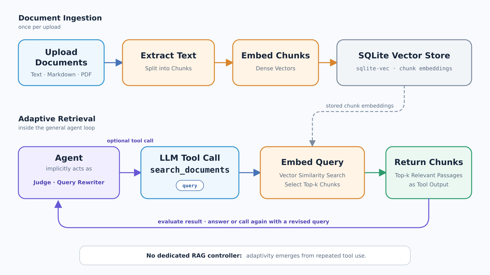

# RAG over project documents

[Back to the overview](../README.md#feature-overview)

RAG lets the agent answer from files the user uploaded to a **project**: text, Markdown, and
PDF. The central decision is that retrieval is **a tool the agent calls (`search_documents`),
not a fixed stage in front of every request**. Unlike [memory](memory.md), which is retrieved
automatically before the first model request of a turn, documents are searched only when the
agent decides they are needed.

## From upload to searchable passage

An upload is parsed, split, embedded, and stored once. Parsing keeps a **citable locator** with
every piece of text — a PDF page number, a Markdown section heading — so an answer can point at
where something came from. Chunks overlap slightly, so a sentence cut at a boundary still
appears whole in its neighbour.

Embeddings run **locally, in the same process as the web server**, using a small ONNX model
rather than vLLM or a remote endpoint: it needs no GPU and keeps document content on the machine
that already stores the chats. The vectors live in the **same SQLite file** as everything else
through the `sqlite-vec` extension, following the same reasoning as memory — no second database
service to run.

Documents belong to exactly one project. The vector table is partitioned by project, and the
project is bound by the server rather than passed by the model, so a chat cannot read another
project's documents by asking for it.

## Why this is adaptive RAG

The pipeline from the lecture chains several LLM steps in a fixed order: a **judge** decides
whether retrieval is needed, a **query rewriter** turns the question into a search query, and a
**second judge** decides whether what came back was sufficient, looping if it was not. Our
implementation has all of these decision points — they are made by the agent inside the normal
tool loop instead of by separate hard-wired stages:

| Pipeline stage | Where it happens here |
| --- | --- |
| Judge: retrieve or not? | The model decides whether to call `search_documents` at all |
| Query rewriter | The model writes the `query` argument — not the raw user message |
| Judge: was that enough? | The model reads the returned passages and either searches again or answers |

The agent controls the wording, how many passages to request, and how many searches to run. It
can refine a query, split a question across several calls, and interleave document search with
[websearch](websearch.md) or a [subagent](subagents.md) when a question needs both. The loop is
bounded by the same round limits as every other tool.

The tradeoff is that these decisions are implicit: there is no separate judge output to evaluate
on its own, and retrieval quality depends on the model deciding sensibly. In exchange we get one
mechanism instead of four, no fixed LLM calls on questions that need no documents at all, and
every search with its query and results visible in the turn's trace.

Passages come back as ordinary tool output, each with its document name and locator. They are
reference material for the current turn, not a new system instruction; how long they stay in
context afterwards is a question of [context management](context-management.md).

Code: [documents.py](../src/intelligent_agents_chat/documents.py) handles parsing, chunking,
storage, and retrieval; [search_documents.py](../src/intelligent_agents_chat/tools/search_documents.py)
exposes it to the agent.
