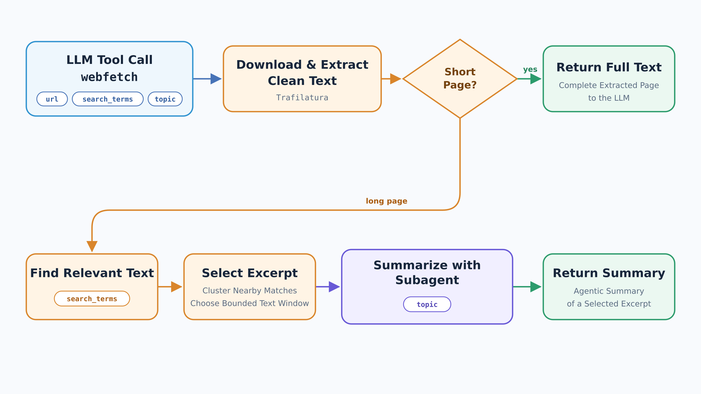

# Websearch

[Back to the overview](../README.md#feature-overview)

Websearch gives the agent access to information outside its model weights. We split it into
two tools: **`web_search` finds sources; `web_fetch` reads a selected source**. The model decides
when to use them and which results deserve a closer look.

`web_search` uses `ddgs` and returns up to five results with a title, URL, and short snippet.
This keeps the initial search small. Snippets can help select a page, but often do not contain
enough information to answer the question, so the agent is prompted to fetch a promising source.

## Reading a page without filling the context

The diagram's `webfetch` step is exposed to the model as `web_fetch`. It downloads the page
and uses **Trafilatura** to extract readable text. Short pages are returned directly. For longer
pages, we select a bounded excerpt and ask a [subagent](subagents.md) to condense it.

Two inputs serve different purposes: `search_terms` locates relevant text by finding clusters
of nearby matches; `topic` tells the summarizer what to focus on. Keeping them separate avoids
broad topic words drowning out the specific terms that locate the relevant passage.

Without search terms, the excerpt starts at the beginning of the page. If supplied terms do
not match, the tool reports that so the agent can try another wording. Partial-page results
are marked as excerpts, and the summary prompt asks to preserve concrete names, dates, and
figures. A small in-memory cache avoids downloading the same page repeatedly.

The design trades full-page coverage for a smaller, more relevant tool result. The agent may
need to fetch another passage; a summary is not the complete source. How tool results are
retained across turns is explained in [context management](context-management.md).

Code: [websearch.py](../src/intelligent_agents_chat/tools/websearch.py) and
[webfetch.py](../src/intelligent_agents_chat/tools/webfetch.py).
